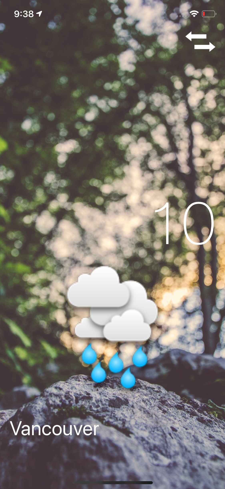
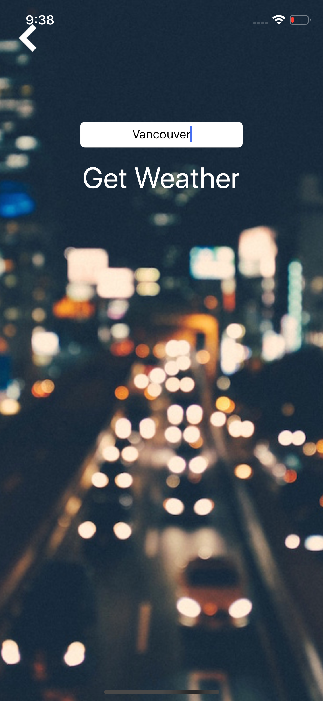

# Clima

    
    

Clima is a location-aware weather app. It will find out where you are in the world and query an open source weather service to retrieve the temperature and weather conditions. Also, you can change the city at the tap of a button. Want to know what's the weather like in Vancouver? Clima is here to help. 
